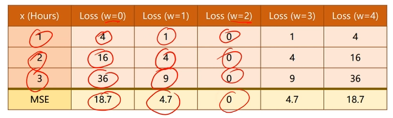

# Ⅰ. 误差函数 `loss-function`

## 1. 定义

假设模型的输出为$y$，真实值为$y^,$，那么误差函数可以表示为：

$
E(w,b) = \frac{1}{2n}\sum_{i=1}^n(f(x_i) - y_i)^2
$

其中，$n$表示样本数量。

## 2. 寻找合理的`w`

### (1) 穷举法

### (2) 最小二乘法

参数`w`和`loss`值呈现趋势，在这里只需要对其求导，一阶导数为0

`x`是一个矩阵，`y`是一个向量，`w`是一个向量，`b`是一个标量。

$
x = \begin{bmatrix}
x_1 & x_2 & \dots & x_n
\end{bmatrix}
$

$
w = \begin{bmatrix}
w_1 & w_2 & \dots & w_n
\end{bmatrix}
$

$
f(x) = w^Tx + b
$

$
f(x_i) = w^Tx_i + b
$

最后求得`w`的表达式为：

$
w = (X^TX)^{-1}X^TY
$

其中，$X$是一个矩阵，$y$是一个向量，$w$是一个向量。
当矩阵`X`有解，且为可逆矩阵时，才可以使用最小二差法。

### (3) 梯度下降法

梯度下降法可以用来更新迭代参数

其中梯度下降法参数更新的计算公式如下：
$
w_i = w_{i-1} - \alpha \frac{\partial E(w,b)}{\partial w}
$

核心：

- 方向
- 步伐